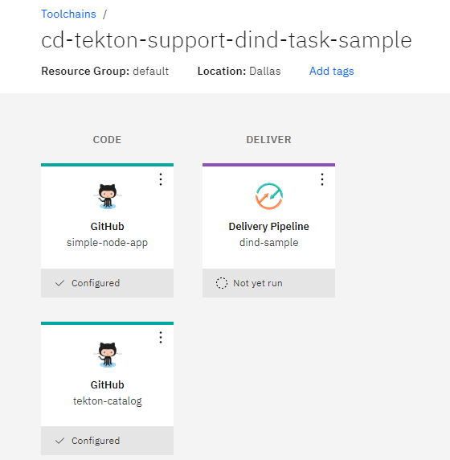
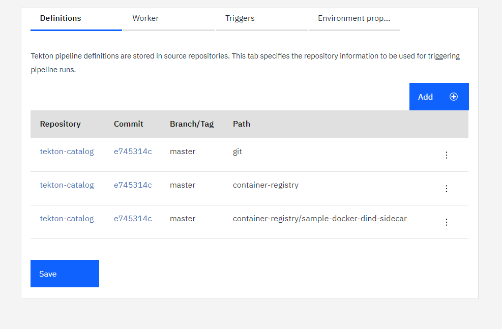
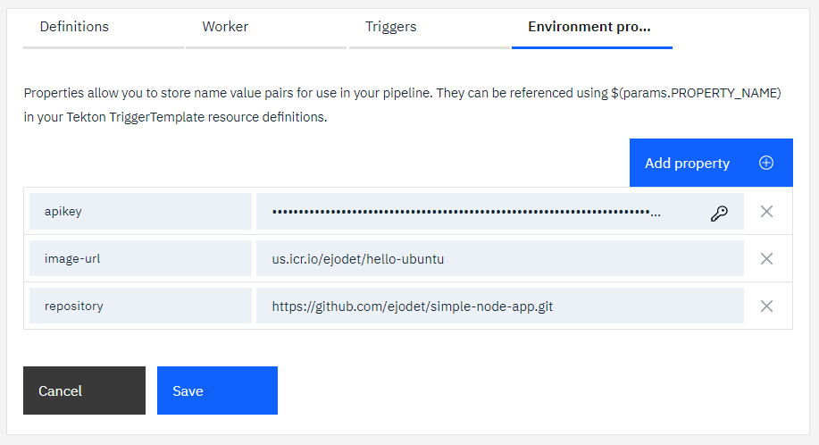
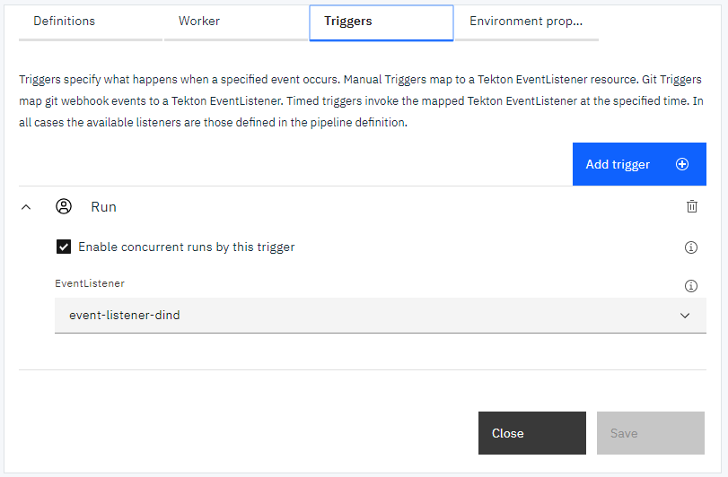
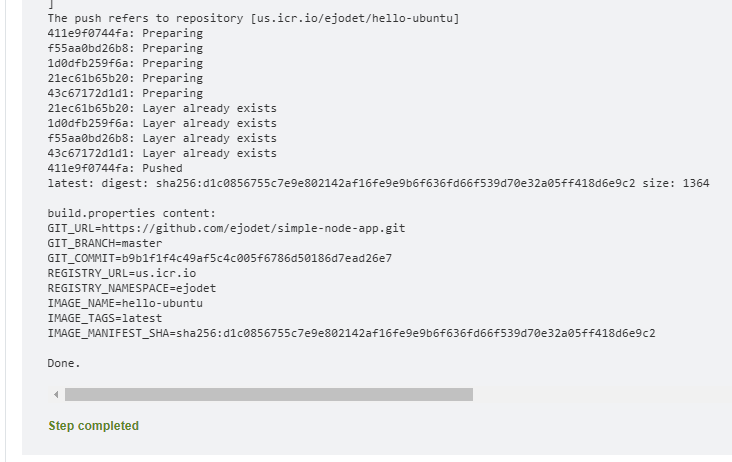

# Docker In Docker (DIND) Task example usage
The `sample-docker-dind-sidecar` sub-directory contains an `dind-no-resources` EventListener definition that you can include in your Tekton pipeline configuration to run an example usage of the `icr-execute-in-dind` and `icr-check-va-scan`. This pipeline definition uses the task's parameter `image-url` to provide the information on image to build and scan.

**Note:** this sample also relies on the clone-repo task to clone the application to containerize.

1) Create or update a toolchain to include:

   - the git repository that you want to clone, which can be private
   - the repository containing this Tekton task
   - a [Tekton pipeline definition](https://cloud.ibm.com/docs/ContinuousDelivery?topic=ContinuousDelivery-tekton-pipelines#create_tekton_pipeline)

   

2) Add the definitions:

   - for the `git-clone-repo` (`git` path)
   - for this task and the sample (`container-registry` and `container-registry/sample-docker-dind-sidecar` paths)

   

3) Add the environment properties:

   - `apikey` to provide an API key used for the ibmcloud login/access
   - `repository` to indicate the git repository url to clone (correspoding to the one integrated in the toolchain)
   - `image-url` to indicate the URL of the image to push to the IBM Cloud Container Registry

   

4) Create a manual trigger to start the sample listener

   

5) Run the pipeline

6) Verify that the image was build and pushed by looking at the pipeline run execution log:

   
